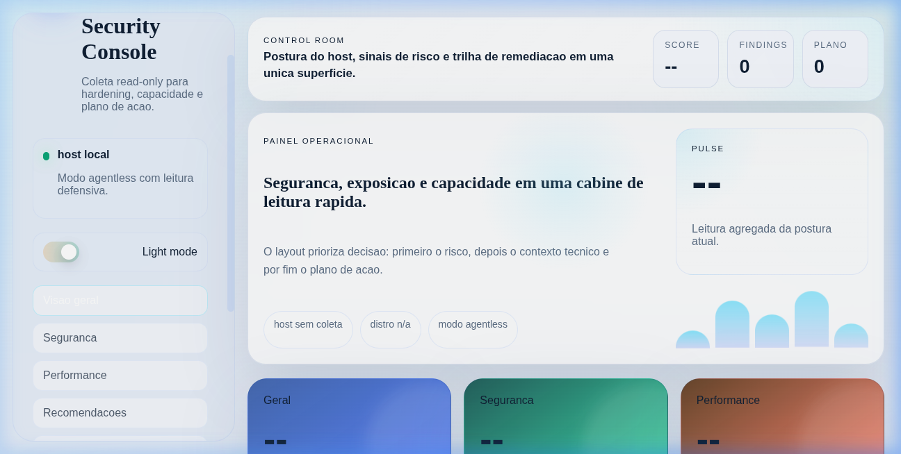
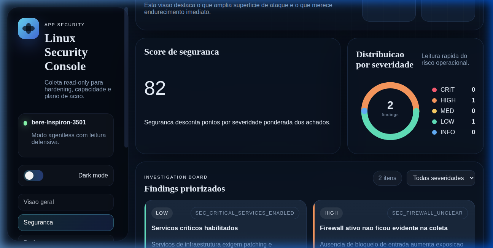
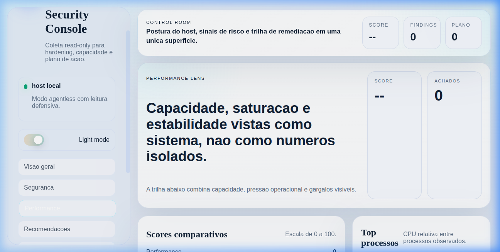
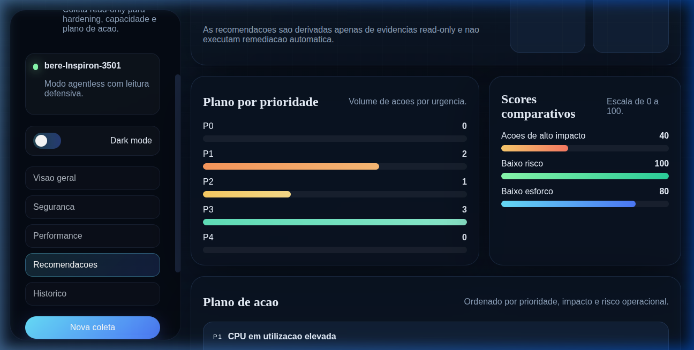

# App Security

Este repositorio contem o produto `App Security Audit`, uma plataforma React + FastAPI para avaliacao read-only de seguranca e performance Linux.
## 📸 Screenshots

### Visão Geral (Overview)


### Segurança


### Performance


### Recomendações


## A) Produto e requisitos

Resumo executivo: a ferramenta coleta evidencias de hosts Linux sem remediacao automatica, calcula scores separados de seguranca e performance, gera um score geral ponderado e produz um plano de acao priorizado. O foco e Blue Team, SRE e lideranca tecnica que precisam de baseline defensiva, capacidade operacional e recomendacoes seguras.

Suposicoes explicitas:

- MVP otimizado para Debian/Ubuntu, com deteccao segura quando comandos nao existem.
- SQLite e suficiente para ambiente local e laboratorios.
- Auth do MVP usa token compartilhado.
- Agent mode existe na arquitetura, mas depende de endpoint remoto configurado.

Detalhamento adicional em [product-overview.md](./docs/product-overview.md).

## B) Arquitetura e threat model

Visao resumida:

1. Frontend React/Vite chama a API FastAPI.
2. A API autentica, registra o scan e agenda a coleta.
3. O coletor executa apenas comandos whitelisted e leituras de `/etc` e `/proc`.
4. A engine de scoring aplica regras externas em JSON.
5. A engine de recomendacoes transforma findings em plano de acao.
6. SQLite guarda historico por hostname e machine-id.
7. Export service produz JSON e PDF.

Threat model resumido em [architecture.md](./docs/architecture.md).

## C) Modelo de dados

Esquema principal documentado em [data-model.md](./docs/data-model.md) e implementado em [models.py](./app/backend/app/db/models.py).

## D) API

Contrato OpenAPI-like em [api-contract.md](./docs/api-contract.md). Rotas implementadas em [scans.py](./app/backend/app/api/routes/scans.py).

## E) Backend

Estrutura principal:

- App FastAPI: [main.py](./app/backend/app/main.py)
- Config e auth: [config.py](./app/backend/app/core/config.py), [auth.py](./app/backend/app/core/auth.py)
- Persistencia: [session.py](./app/backend/app/db/session.py), [models.py](./app/backend/app/db/models.py)
- Coletor read-only: [linux.py](./app/backend/app/collectors/linux.py)
- Parsing, scoring e recomendacoes: [parser.py](./app/backend/app/services/parser.py), [scoring.py](./app/backend/app/services/scoring.py), [recommendations.py](./app/backend/app/services/recommendations.py)
- Orquestracao: [scan_service.py](./app/backend/app/services/scan_service.py)
- Regras externas: [rules.json](./app/backend/app/config/rules.json)

### Variáveis de Ambiente do Backend

| Variável | Padrão | Descrição |
|---|---|---|
| `APPSEC_API_TOKEN` | `changeme-token` | Token de autenticação da API |
| `APPSEC_DATABASE_URL` | `sqlite:///./app_security_audit.db` | URL do banco de dados |
| `APPSEC_EXPORT_DIR` | `./exports` | Diretório de exportações |
| `APPSEC_HOST_FS_PREFIX` | *(vazio)* | Prefixo do sistema de arquivos do host (ex: `/host` no Docker) |
| `APPSEC_CORS_ORIGINS` | `["http://localhost:5173"]` | Origens permitidas CORS |
| `APPSEC_DEV_RECREATE_DB` | `false` | Recriar banco automaticamente (só dev) |


```bash
cd app/backend
python3.11 -m venv .venv
source .venv/bin/activate
pip install -e .[dev]
export APPSEC_API_TOKEN=changeme-token
uvicorn app.main:app --reload
```

Migracao local rapida:

- O startup aplica uma migracao SQLite leve para adicionar colunas novas conhecidas, como `recommendations.metadata`.
- Para recriar o banco automaticamente em desenvolvimento, use `APPSEC_DEV_RECREATE_DB=true`.
- Exemplo:

```bash
export APPSEC_DEV_RECREATE_DB=true
uvicorn app.main:app --reload
```

## F) Frontend

Estrutura principal:

- Shell e rotas: [App.jsx](./app/frontend/src/App.jsx)
- Estado e API client: [useAuditData.js](./app/frontend/src/lib/useAuditData.js), [api.js](./app/frontend/src/lib/api.js)
- Paginas: [OverviewPage.jsx](./app/frontend/src/pages/OverviewPage.jsx), [SecurityPage.jsx](./app/frontend/src/pages/SecurityPage.jsx), [PerformancePage.jsx](./app/frontend/src/pages/PerformancePage.jsx), [RecommendationsPage.jsx](./app/frontend/src/pages/RecommendationsPage.jsx), [HistoryPage.jsx](./app/frontend/src/pages/HistoryPage.jsx)
- Componentes: [ScoreCards.jsx](./app/frontend/src/components/ScoreCards.jsx), [FindingsTable.jsx](./app/frontend/src/components/FindingsTable.jsx), [RecommendationList.jsx](./app/frontend/src/components/RecommendationList.jsx), [ExportPanel.jsx](./app/frontend/src/components/ExportPanel.jsx)
- Estilo responsivo: [app.css](./app/frontend/src/styles/app.css)

Setup local do frontend:

```bash
cd app/frontend
npm install
cp .env.example .env
npm run dev
```

## G) Testes

Backend:

```bash
cd app/backend
pytest
```

Frontend:

```bash
cd app/frontend
npm test
```

Arquivos de teste:

- [test_parser.py](./app/backend/tests/test_parser.py)
- [test_scoring.py](./app/backend/tests/test_scoring.py)
- [ScoreCards.test.jsx](./app/frontend/src/components/ScoreCards.test.jsx)
- [FindingsTable.test.jsx](./app/frontend/src/components/FindingsTable.test.jsx)

## H) Modos de Execução com Permissões de Auditoria

Para que a auditoria funcione com acesso completo ao host Linux (leitura de `/etc/sudoers`, regras de firewall, etc.), dois modos estão disponíveis:

### Modo 1: Docker Privilegiado (padrão neste repositório)

O `docker-compose.yml` já está configurado com:
- `privileged: true` — acesso completo ao kernel do host
- `network_mode: "host"` e `pid: "host"` — enxerga processos e rede do host
- `/:/host:ro` — sistema de arquivos do host montado em somente leitura
- `APPSEC_HOST_FS_PREFIX=/host` — o backend lê arquivos sob `/host/etc/...` e executa comandos via `chroot /host`

```bash
# Subir toda a stack com auditoria completa do host
docker compose up --build
# Backend disponível em http://localhost:8001 | Frontend em http://localhost:8080
```

> ⚠️ **Atenção:** o modo Docker privilegiado concede acesso amplo ao host. Use apenas em ambientes controlados.

### Modo 2: Serviço Systemd Nativo (recomendado para produção)

O script `install_systemd.sh` instala o backend como serviço systemd rodando como `root` diretamente no host. Neste modo o `APPSEC_HOST_FS_PREFIX` não é necessário pois o processo já tem acesso root nativo.

```bash
cd app/backend
./install_systemd.sh
# Backend disponível em http://localhost:8001

# Verificar status
sudo systemctl status appsec-backend.service

# Ver logs em tempo real
sudo journalctl -u appsec-backend.service -f
```

### Modo 3: Desenvolvimento Local (sem root)

Para desenvolvimento e testes unitários, sem acesso root (auditoria limitada ao próprio processo):

```bash
cd app/backend
python3.11 -m venv .venv
source .venv/bin/activate
pip install -e .[dev]
export APPSEC_API_TOKEN=changeme-token
uvicorn app.main:app --reload
```

Migracao local rapida:

- O startup aplica uma migracao SQLite leve para adicionar colunas novas conhecidas, como `recommendations.metadata`.
- Para recriar o banco automaticamente em desenvolvimento, use `APPSEC_DEV_RECREATE_DB=true`.

```bash
export APPSEC_DEV_RECREATE_DB=true
uvicorn app.main:app --reload
```

Arquivos de infraestrutura:

- Compose: [docker-compose.yml](./docker-compose.yml)
- Script Systemd: [install_systemd.sh](./app/backend/install_systemd.sh)
- Backend image: [Dockerfile](./app/backend/Dockerfile)
- Frontend image: [Dockerfile](./app/frontend/Dockerfile)


## I) README operacional

Contribuicao:

1. Crie branch curta e mantenha regras/thresholds em [rules.json](./app/backend/app/config/rules.json).
2. Nao adicione comandos destrutivos nem shell interpolation no coletor.
3. Todo novo check precisa de teste de parsing ou scoring.
4. Documente a justificativa da coleta em [collection-commands.md](./docs/collection-commands.md).

## J) Checklist de go-live

1. Trocar `APPSEC_API_TOKEN` por segredo real.
2. Restringir `APPSEC_CORS_ORIGINS` aos dominos finais.
3. Validar agentless em host Linux de referencia sem root.
4. Revisar impacto de `find` e ajustar escopo por ambiente.
5. Criar backup/rotacao do SQLite e diretio de exports.
6. Adicionar observabilidade externa para logs JSON.
7. Validar PDF/JSON export com politicas internas.
8. Executar smoke tests do frontend e API antes de publicar.
9. Desativar `APPSEC_DEV_RECREATE_DB` fora de ambiente local.

## Artefatos de planejamento

- Produto: [product-overview.md](./docs/product-overview.md)
- Arquitetura: [architecture.md](./docs/architecture.md)
- Modelo de dados: [data-model.md](./docs/data-model.md)
- Backlog e roadmap: [backlog-roadmap.md](./docs/backlog-roadmap.md)
- API: [api-contract.md](./docs/api-contract.md)
- Comandos de coleta: [collection-commands.md](./docs/collection-commands.md)
